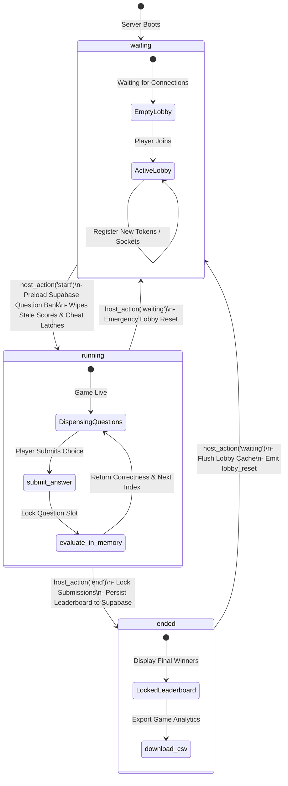
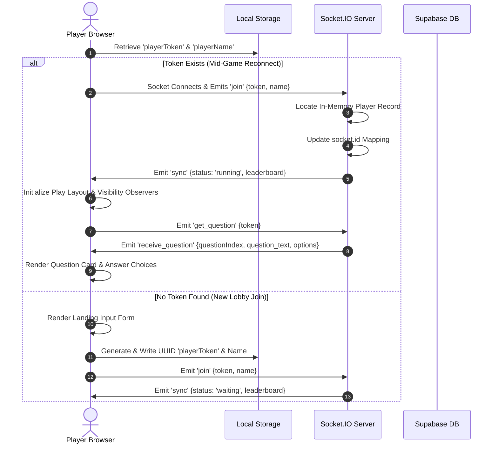

# ⚡ ZapQuiz

ZapQuiz is a highly robust, server-authoritative, real-time asynchronous quiz platform (inspired by the fast-paced gameplay of Kahoot! and the player-paced mechanics of Blooket) built with a strong focus on absolute fairness, zero-latency rendering, and proactive anti-cheat protections.

The platform supports a fully decentralized, player-paced gameplay loop connected to a centralized administrative lobby. Designed for large-group events (100+ concurrent players), ZapQuiz bypasses the database performance constraints of traditional quiz platforms by caching operations in-memory and using high-frequency WebSockets for game state synchronizations.

---

## 🏗️ Architecture Overview

ZapQuiz is designed around a secure, three-tier architecture that segregates database query overhead from the active, high-frequency gameplay loop:

```
┌─────────────────────────────────┐          ┌─────────────────────────────────┐          ┌─────────────────────────────────┐
│                                 │          │                                 │          │                                 │
│        Next.js 16 Client        │ ────────>│         Node.js Backend         │ ────────>│          Supabase DB            │
│  (React 19 + Socket.IO Client)  │          │  (Express + Socket.IO Engine)   │          │   (PostgreSQL + RLS + RAM)      │
│  Tactile 3D UI & Cheat Sensors  │ <────────│    Authoritative In-Memory FSM  │ <────────│   Question Bank & Cold Storage  │
│                                 │          │                                 │          │                                 │
└─────────────────────────────────┘          └─────────────────────────────────┘          └─────────────────────────────────┘
```

1. **Frontend Client (Next.js 16 + React 19 + Socket.IO Client)**: Implements the "Sunshine Arcade" tactile user interface for both players and hosts. Connects to the server via a single Socket.IO singleton, tracks browser window visibility/focus state using local browser APIs, and handles persistent sessions via local storage reconnection tokens.
2. **Authoritative Server (Node.js + Express + Socket.IO)**: The single source of truth. Handles the gameplay loop entirely in-memory, verifies user submissions, computes player statistics, and drives lobby operations. The server **never** exposes correct answers to the client, preventing F12 browser inspections.
3. **Database Layer (Supabase PostgreSQL)**: Serves as secure cold storage. Question pools are fetched in bulk *once* into server memory at lobby start, removing database-query round-trip times during live gameplay. Final leaderboard scores and tab-switching logs are persisted in a single bulk transaction upon game conclusion.

---

## 🌟 Core Features

### 🎮 Player-Paced Asynchronous Gameplay
Unlike traditional quiz apps that force players to wait on a global synchronized countdown, ZapQuiz lets players answer questions at their own speed. The server dispenses random questions from its cached bank using smart history buffers (preventing immediate repetition in small pools), ensuring zero database sync lag and a fluid, engaging user experience.

### 🔄 Persistent Reconnection Protocol
A robust session handshake guarantees that players who refresh their page, lose network signal, or accidentally close their browser can resume mid-game with zero progress loss. Reconnection is handled using a unique `playerToken` written to the browser's `localStorage` upon joining.

### 🛡️ Real-Time Anti-Cheat Suite
* **Hidden Correct Answers**: The client never receives correct answers. The server evaluates accuracy in-memory.
* **Option Index Obfuscation**: Evaluation results return only correctness boolean flags and index mapping references, rendering passive network monitors useless.
* **Active Tab Monitoring**: Employs the HTML5 Page Visibility API and window focus triggers to detect if players switch tabs or open developer tools. A persistent, irreversible `⚠️ Tab Switch` warning is instantly broadcasted to the Host Dashboard.
* **Session Integrity**: Restricts duplicate nicknames and locks submissions to prevent replay or double-scoring attacks.

### 📊 Real-Time Host Command Center
Hosts possess a full administrative dashboard featuring:
* **Start Game**: Populates server memory from Supabase and initializes all connection state trackers.
* **End Game**: Locks gameplay submissions immediately and commits leaderboards in bulk.
* **Lobby Reset**: Flushes memory pools and redirects all connected players to the onboarding landing page.
* **Data Export**: Generates and downloads a clean `.csv` spreadsheet containing final ranks, absolute scores, question completion counts, accuracy ratings, and visibility violation logs.

---

## 🔄 State Machine & Handshake Protocols

### Game Lifecycle FSM
The server operates as a strict, finite state machine with three core statuses:



### Reconnection & Session Handshake
This sequence diagram tracks how the client recovers game state during an accidental mid-game browser refresh:



---

## 📡 Socket.IO API Reference

### Inbound Events (Client to Server)

| Event Name | Payload Structure | Server Behavior & Validation Rules |
| :--- | :--- | :--- |
| `join` | `{ token: string, name: string, password?: string }` | 1. Aborts if token is missing.<br>2. Verifies `password` matches host variable if `token === 'host-view'`. Emit `auth_error` on mismatch.<br>3. Normalizes name to Unicode `NFC`, trims whitespace, and slices to **28 chars**.<br>4. Registers/updates token mapping to current `socket.id` and broadcasts state. |
| `get_question` | `{ token: string }` | 1. Verifies player existence and that game state status is `'running'`.<br>2. Retrieves player's history queues (`unseenQuestions` and `recentQuestions` buffer).<br>3. Selects a random index from unseen questions that do not exist in the last 3 questions answered.<br>4. Updates active in-memory trackers, locks `player.currentQuestionIndex`, and emits `receive_question` back to the socket. |
| `submit_answer` | `{ token: string, questionIndex: number, answer: string }` | 1. Verifies player exists and status is `'running'`.<br>2. Validates that `questionIndex` matches the server-recorded `player.currentQuestionIndex` (aborts if mismatched or null).<br>3. Immediately clears `player.currentQuestionIndex = null` (submission lock).<br>4. Evaluates in-memory correctness. If correct, increments `player.score` by **100** points.<br>5. Broadcasts leaderboard and emits `answer_result` back to player. |
| `tab_switched` | `{ token: string }` | 1. Verifies player existence and status is `'running'`.<br>2. Sets `player.outTabbed = true` (one-way latch).<br>3. Broadcasts the warning flag to all views. |
| `host_action` | `{ action: string, password?: string }` | 1. Validates host password credential. Emit `auth_error` on mismatch.<br>2. **'start'**: Preloads questions from Supabase, sets status to `'running'`, resets scores/flags, and broadcasts state.<br>3. **'end'**: Sets status to `'ended'`, bulk-upserts results to Supabase, and broadcasts state.<br>4. **'waiting'**: Sets status to `'waiting'`, flushes in-memory player maps, and broadcasts `lobby_reset`. |

### Outbound Events (Server to Client)

| Event Name | Payload Structure | Triggering Event / Source |
| :--- | :--- | :--- |
| `auth_error` | `{ message: string }` | Failed host validation during `join` or `host_action`. |
| `sync` | `{ status: string, leaderboard: Array<Player> }` | Sent directly to a connecting client upon initial handshake. |
| `state_update` | `{ status: string, leaderboard: Array<Player> }` | Broadcasted globally upon lobby changes, answer submissions, or visibility switches. |
| `receive_question` | `{ questionIndex: number, question_text: string, options: Array<string> }` | Sent to an active player client following a `get_question` request. Includes options stripped of the correct answer. |
| `answer_result` | `{ isCorrect: boolean, correctOptionIndex: number }` | Sent to a player client following answer verification. |
| `lobby_reset` | *None* | Emitted globally when the host transitions the lobby back to `'waiting'`. |

---

## 💾 Database Schema

The PostgreSQL schema is structured to restrict public database reads and writes. To initialize your schema, run the following commands inside your **Supabase SQL Editor**:

```sql
-- 1. Create quiz_state table (Restricted to a single-row constraint)
CREATE TABLE quiz_state (
  id integer PRIMARY KEY DEFAULT 1,
  status text NOT NULL DEFAULT 'waiting', -- 'waiting', 'running', 'ended'
  current_question_index integer NOT NULL DEFAULT 0,
  timer_ends_at timestamptz,
  CONSTRAINT single_row CHECK (id = 1)
);

-- Insert the default administrative state
INSERT INTO quiz_state (id, status, current_question_index) 
VALUES (1, 'waiting', 0)
ON CONFLICT (id) DO NOTHING;

-- 2. Create players table (Leaderboard and visibility log storage)
CREATE TABLE players (
  id uuid PRIMARY KEY DEFAULT gen_random_uuid(),
  display_name text NOT NULL,
  score integer NOT NULL DEFAULT 0,
  out_tabbed boolean NOT NULL DEFAULT false,
  joined_at timestamptz DEFAULT now()
);

-- 3. Create questions table (Stored securely inside private DB schema)
CREATE TABLE questions (
  id serial PRIMARY KEY,
  question_text text NOT NULL,
  options jsonb NOT NULL, -- Format: ["Paris", "London", "Berlin", "Madrid"]
  correct_answer text NOT NULL -- Hidden from frontend clients
);

-- 4. Enable Row Level Security (RLS) on all tables
ALTER TABLE quiz_state ENABLE ROW LEVEL SECURITY;
ALTER TABLE players ENABLE ROW LEVEL SECURITY;
ALTER TABLE questions ENABLE ROW LEVEL SECURITY;

-- 5. Establish RLS Security Policies
-- quiz_state: Globally readable, writable only by server services.
CREATE POLICY "Public read access for quiz_state" ON quiz_state FOR SELECT USING (true);

-- players: Globally readable, writable only on initial creation.
CREATE POLICY "Public read access for players" ON players FOR SELECT USING (true);
CREATE POLICY "Public insert access for players" ON players FOR INSERT WITH CHECK (true);

-- questions: PUBLIC READ ACCESS IS BLOCKED.
-- No select policies are established. Web clients cannot query correct answers.
-- Server authenticates with SUPABASE_SERVICE_ROLE_KEY to bypass RLS and preload data.

-- 6. Enable Realtime Publications
BEGIN;
  DROP PUBLICATION IF EXISTS supabase_realtime;
  CREATE PUBLICATION supabase_realtime;
COMMIT;
ALTER PUBLICATION supabase_realtime ADD TABLE quiz_state;
ALTER PUBLICATION supabase_realtime ADD TABLE players;
```

---

## 🎨 Design System: "Sunshine Arcade"

The frontend layout is styled with a joyful, high-polish theme called **"Sunshine Arcade"** (defined completely within [globals.css](file:///D:/Vs%20Code/Kahoot/frontend/src/app/globals.css)).

* **Fluid CSS Gradients**: The background is a shifting, five-color moving linear gradient (`#FF6B6B` → `#FFE66D` → `#4ECDC4` → `#C77DFF` → `#4D96FF`) panning slowly via a continuous `12s` CSS keyframe loop.
* **Background Depth**: Custom floating blob spheres rendered via `body::before` and `body::after` translate dynamically in opposite directions (`pointer-events: none`).
* **Tactile 3D Buttons**: Buttons and game cards employ an active `translateY` offset paired with absolute color-matched bottom borders. When clicked, buttons transition downwards along the Y-axis by `8px` while collapsing their bottom shadow to simulate physical arcade buttons.
* **Friendly Typography**: Displays use `'Nunito'` (soft, rounded, game-show aesthetic) while dense textual tables utilize `'Plus Jakarta Sans'` (highly legible, geometric body font).
* **Responsive Geometric Answer Icons**: Choice selection buttons use recognizable SVG geometries matching classic school gameplay models (Triangle, Diamond, Circle, Square).

---

## 📁 Repository Structure

```
FinDaHuman/ZapQuiz/
├── backend/
│   ├── .env                    # Node.js env configuration
│   ├── .gitignore              # Backend git excludes
│   ├── package.json            # Express & Socket.IO server dependencies
│   ├── package-lock.json       # Backend locked package versions
│   └── server.js               # In-Memory state engine & Socket server
├── frontend/
│   ├── src/
│   │   ├── app/
│   │   │   ├── host/
│   │   │   │   └── page.tsx    # Live Host panel, alerts & CSV exporter
│   │   │   ├── play/
│   │   │   │   └── page.tsx    # Responsive player screens, timers & cheat sensors
│   │   │   ├── favicon.ico     # Brand favicon assets
│   │   │   ├── globals.css     # Sunshine Arcade CSS layout and design system
│   │   │   └── page.tsx        # Name input landing page & auto-redirect logic
│   │   └── lib/
│   │       ├── socket.ts       # Socket.IO client singleton setup
│   │       └── supabase.ts     # Supabase instance config (Standard client)
│   ├── .env.example            # Client-side configuration reference
│   ├── .env.local              # Local frontend socket URLs
│   ├── eslint.config.mjs       # Client lint config
│   ├── next.config.ts          # Next.js bundler settings
│   ├── package.json            # Client-side dependencies (Next.js 16 + React 19)
│   ├── tsconfig.json           # Strict TypeScript configuration
│   └── README.md               # Standard frontend summary
├── supabase-schema.sql         # Core SQL script to initialize Database
├── buglog.md                   # Chronological development debug logs
├── plan.md                     # Base architectural roadmap
└── README.md                   # Master Repository README (This Document)
```

---

## 🛠️ Local Installation & Setup

### Prerequisites
* **Node.js** (v18 or higher recommended)
* **Supabase Account** (to host database schema and initial questions)

### Step 1: Database Initialization
1. Navigate to your **Supabase Dashboard** and open the **SQL Editor**.
2. Copy and paste the contents of `supabase-schema.sql` into the editor window.
3. Click **Run**. This generates the core PostgreSQL tables, configures Row-Level Security policies, and inserts a set of sample quiz questions.

### Step 2: Configure Environment Variables

Create a file named `.env` in the `backend/` directory:
```env
# Server Port Configuration
PORT=3001

# Host Authentication Credential
HOST_PASSWORD=your_secure_lobby_password

# Supabase Credentials (Requires Service Role bypass)
SUPABASE_URL=https://your-project-reference.supabase.co
SUPABASE_SERVICE_ROLE_KEY=your_private_supabase_service_role_key
```

Create a file named `.env.local` in the `frontend/` directory:
```env
# WebSocket API Endpoint URL
NEXT_PUBLIC_SOCKET_URL=http://localhost:3001
```

### Step 3: Launch the Backend
Open a terminal directory, navigate to the backend folder, fetch dependencies, and start the game server:
```bash
cd backend
npm install
node server.js
```
The server will bind to the port and log:
`🚀 Socket.IO game server running on port 3001`

### Step 4: Launch the Frontend
Open a second terminal window, navigate to the frontend folder, fetch dependencies, and launch the dev environment:
```bash
cd frontend
npm install
npm run dev
```
Open [http://localhost:3000](http://localhost:3000) to join the game as a player, or browse to [http://localhost:3000/host](http://localhost:3000/host) to control the game show!

---

## 🔒 Security Best Practices Implemented

* **Service-Role Operations Only**: Correct answers are fetched exclusively by the server using highly restricted private credentials. Correct answer fields are strictly omitted from websocket payloads sent to standard player sockets.
* **Client Mutation Lockdown**: Clients have zero write permissions in Supabase. All scoring operations, state changes, and lobby resets are routed through socket verification routines.
* **Persistent Cheat Latches**: When the page visibility sensor detects a window blur, the resulting cheat flag is saved in server memory and locked to the player's unique session token. Refreshing the browser or reconnecting does not clear the warning marker.
* **Unicode Slicing & Sanitation**: Usernames are cleaned of potential XSS characters, normalized to `NFC`, and limited to `28` characters to prevent rendering overflows.

---

## 🔮 Future Enhancements (Recommended)

1. **Submit Answer Rate-Limiting**: Introduce a `1000ms` buffer window between question transitions to protect the server from automated response script spamming.
2. **JWT-Signed Session Tokens**: Upgrade standard localStorage strings to server-signed JSON Web Tokens to prevent session spoofing and name-hijacking attacks.
3. **Lobby Sweep Garbage Collection**: Implement a background cron worker to sweep away player records whose sockets have been disconnected for more than 15 minutes, protecting server memory from long-term memory leaks.
4. **Unhandled Database Exception Fallbacks**: Enforce strict `try/catch` checks on Supabase upsert calls during game end, notifying the host dashboard with descriptive errors if data writes fail.
