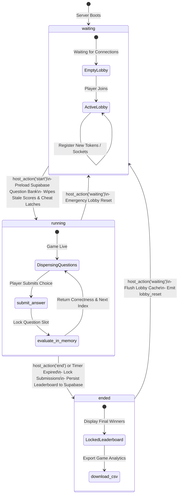
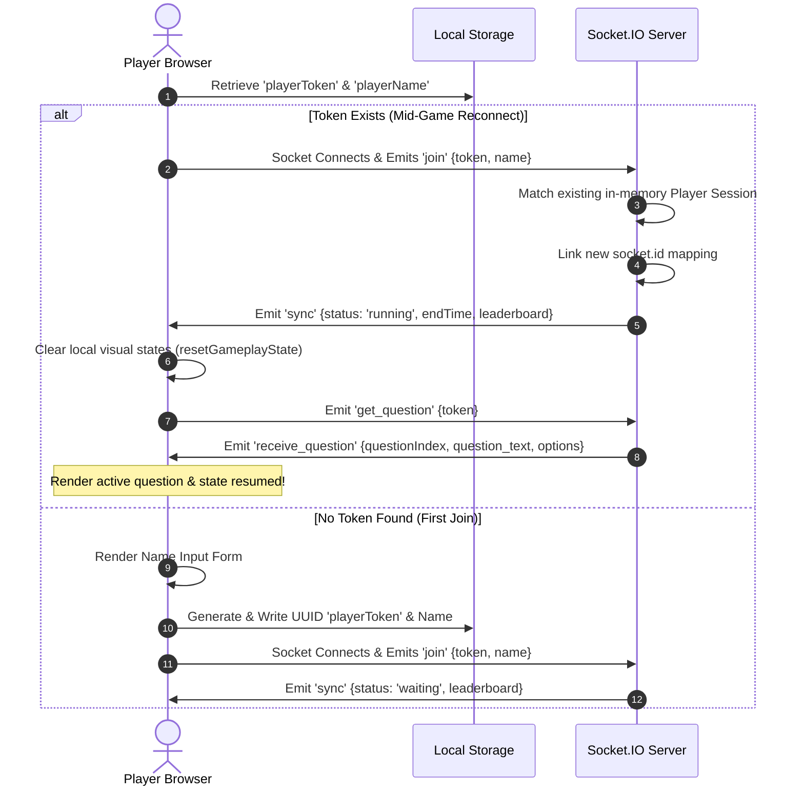
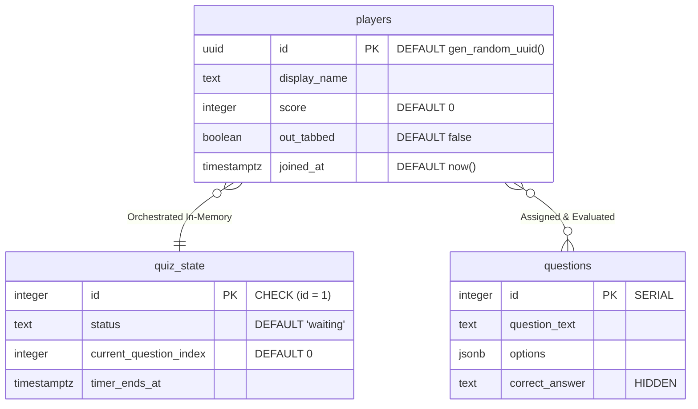
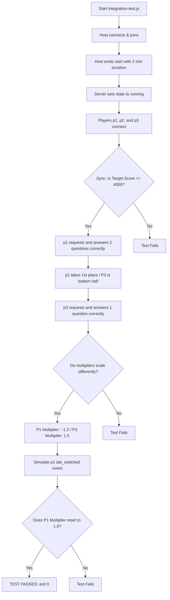

# ⚡ ZapQuiz

ZapQuiz is a highly robust, server-authoritative, real-time asynchronous quiz platform (inspired by the fast-paced gameplay of Kahoot! and the player-paced mechanics of Blooket) built with a strong focus on absolute fairness, zero-latency rendering, and proactive anti-cheat protections.

The platform supports a fully decentralized, player-paced gameplay loop connected to a centralized administrative lobby. Designed for large-group events (100+ concurrent players), ZapQuiz bypasses the database performance constraints of traditional quiz platforms by caching operations in-memory and using high-frequency WebSockets for game state synchronization.

---

## 🏗️ Architecture Overview

ZapQuiz is designed around a secure, three-tier architecture that segregates database query overhead from the active, high-frequency gameplay loop:

```
┌─────────────────────────────────┐          ┌─────────────────────────────────┐          ┌─────────────────────────────────┐
│                                 │          │                                 │          │                                 │
│        Next.js 16 Client        │ ────────>│         Node.js Backend         │ ────────>│          Supabase DB            │
│  (React 19 + Socket.IO Client)  │          │  (Express + Socket.IO Engine)   │          │   (PostgreSQL + RLS + RAM)      │
│  Tactile 3D UI & Cheat Sensors  │ <────────│    Authoritative In-Memory FSM  │ <────────│   Question Bank & Cold Storage  │
│                                 │          │                                 │          │                                 │
└─────────────────────────────────┘          └─────────────────────────────────┘          └─────────────────────────────────┘
```

1. **Frontend Client (Next.js 16 + React 19 + Socket.IO Client)**: Implements the "Sunshine Arcade" tactile user interface for both players and hosts. Connects to the server via a single Socket.IO singleton, tracks browser window visibility/focus state using local browser APIs, and handles persistent sessions via local storage reconnection tokens.
2. **Authoritative Server (Node.js + Express + Socket.IO)**: The single source of truth. Handles the gameplay loop entirely in-memory, verifies user submissions, computes player statistics, and drives lobby operations. The server **never** exposes correct answers to the client, preventing F12 browser inspections.
3. **Database Layer (Supabase PostgreSQL)**: Serves as secure cold storage. Question pools are fetched in bulk *once* into server memory at lobby start, removing database-query round-trip times during live gameplay. Final leaderboard scores and tab-switching logs are persisted in a single bulk transaction upon game conclusion.

---

## 📂 Repository Structure

The ZapQuiz project is split into a modern decoupled architecture, comprising a Next.js App Router frontend and an Express-based Node.js backend. This separation provides clean lines of concerns.

```
FinDaHuman/ZapQuiz/
├── backend/                       # Express + Socket.IO Server Engine
│   ├── .env                       # Local server configuration file (Excluded from git)
│   ├── .gitignore                 # Backend-specific git ignore rules
│   ├── server.js                  # Main game loop, FSM state caching, Socket handlers, Supabase service client
│   ├── integration-test.js        # End-to-end local validation suite simulating Host/Player clients
│   ├── package.json               # Backend dependency declarations (express, socket.io, @supabase/supabase-js)
│   └── package-lock.json          # Backend locked package versions
├── frontend/                      # Next.js 16 App Router Frontend Client
│   ├── src/
│   │   ├── app/                   # Next.js App Routing Pages
│   │   │   ├── host/
│   │   │   │   └── page.tsx       # Live Host Panel (lobby view, dynamic podiums, CSV analyst downloader)
│   │   │   ├── play/
│   │   │   │   └── page.tsx       # Responsive Player dashboard (active questions, timers, cheat visibility sensors)
│   │   │   ├── globals.css        # Sunshine Arcade Design System (vibrant CSS variables and 3D utilities)
│   │   │   ├── layout.tsx         # Root Layout (Google Font preconnects, viewport styling wrapper)
│   │   │   └── page.tsx           # Lobby onboarding landing page (name entry and reconnection checks)
│   │   └── lib/                   # ephemaral singletons
│   │       ├── socket.ts          # Manual auto-connect Socket.IO client singleton
│   │       └── supabase.ts        # Supabase config client (standard public vs next-service-role APIs)
│   ├── .env.example               # Frontend environment template
│   ├── .env.local                 # Local client-side configurations (Socket socket endpoints)
│   ├── eslint.config.mjs          # Static analysis configurations
│   ├── next.config.ts             # NextJS compiler properties
│   ├── package.json               # Frontend dependencies (React 19, Next 16, Socket.IO client)
│   └── tsconfig.json              # Strict TypeScript type mapping configurations
├── supabase-schema.sql         # Production DDL schema setting tables, RLS rules, and sample seeds
├── buglog.md                   # Chronological development debug logs
├── plan.md                     # Base architectural roadmap
└── README.md                   # Master Repository README (This Document)
```

---

## 🔄 State Machine & Handshake Protocols

### 1. Game Lifecycle Finite State Machine (FSM)
The server operates as a strict, finite state machine with three core statuses: `waiting`, `running`, and `ended`.



---

### 2. Player Reconnection & Session Handshake
This sequence diagram tracks how the client recovers game state during an accidental mid-game browser refresh or network socket drop:



---

## 🎮 System Components Detailed Analysis

### 1. Frontend Core & "Sunshine Arcade" Design System
The visual style is characterized by the custom **"Sunshine Arcade"** theme, defined entirely via Vanilla CSS in `globals.css`.
* **Vibrant Animated Backgrounds**: A slow, five-color moving linear gradient (`#FF6B6B` → `#FFE66D` → `#4ECDC4` → `#C77DFF` → `#4D96FF`) pans continuously via a `12s` linear keyframe animation.
* **Tactile 3D Buttons & Cards**: Renders custom buttons (`.btn-primary`, `.choice-btn`) that translate downwards by `5px` and scale down their bottom block-shadow on `:active` clicks, simulating mechanical tactile click buttons.
* **Premium Typography**: Integrates Google Fonts directly inside the layout: `'Nunito'` is imported for big, friendly, rounded headers and badges, while `'Plus Jakarta Sans'` handles details and data grids.
* **Animated Ranks**: Uses custom inline styling indices (`--i`) to trigger delayed slide-in animations when the host leaderboard displays player rankings.

### 2. Player Gameplay & Real-Time Anti-Cheat Suite
Implemented in `frontend/src/app/play/page.tsx`, the player page is a resilient state machine coordinating three views depending on game state:
* **The "Duck" Progress Track**: An engaging dynamic dashboard rendering the user's score, current streak, and nearby leaderboard competitors as sliding indicator tags. Multiplier states dynamically colorize progress tracks with shifting gradients (medium-speed orange for `2x` streaks, high-speed flashing red-orange for `3x` streaks).
* **Active Anti-Cheat blur sensor**: Employs the HTML5 Page Visibility API and browser focus trackers to detect if a player shifts tabs or minimizes the gameplay window. Tab-switching instantly fires a socket trigger, setting the server side `outTabbed` flag to `true`, wiping active streaks, dropping their multiplier to `1.0`, and highlighting a `⚠️ Tab Switch` badge on the Host Command Center.
* **Security Decoupling**: Question payloads sent to clients **do not contain answers** (neither correct indices nor solution strings). The client is only served `question_text` and the `options` choices array. Answer evaluation occurs strictly on the server side.

### 3. Real-Time Host Command Center & Analytical CSV Exporter
Implemented in `frontend/src/app/host/page.tsx`, this dashboard acts as the controller for instructors and event hosts:
* **Live Analytics Indicators**: Tracks average accuracy, total player counts, active tab switches, and a live top 10 leaderboard with responsive transition curves.
* **Ephemaral Time Synchronization**: Rather than sending frequent timestamp packets, the client calculates remaining time locally by running a 1-second interval against the server's synchronized `endTime` timestamp, guaranteeing zero offset.
* **Analytical CSV Exporter**: Gated strictly to the `'ended'` status, the host can download a fully populated spreadsheet containing rank, display name, total score, questions answered, correct answers count, rounded accuracy percentages, and focus visibility violation logs. The export includes custom regex sanitization to escape inner double quotes (`" -> ""`), defending against CSV Injection attacks.

### 4. Server-Authoritative Backend Engine
Implemented in `backend/server.js`, the Node.js Express server manages the high-concurrency lifecycle in RAM:
* **In-Memory Cache FSM**: Fast gameplay operations are kept in RAM (`gameState.players[token]`), which maps each player's streak, catch-up multiplier, and remaining question index array.
* **Non-Repeating Randomization**: To maintain competitive engagement, the server pulls indices from an array of unseen question indices, referencing a sliding history buffer `recentQuestions` of the last 3 questions served to prevent duplicate repetition cycles.
* **Debounced State Updates**: To defend the server CPU and WebSocket threads from event flooding during high-player actions, global state updates are managed via a `250ms` debouncer, bundling multiple player answers into a single broadcast packet.
* **Catch-Up scoring dynamics**: Scoring calculations award a base of 50 points scaled by the player's catch-up multiplier. The server calculates multipliers dynamically on each response: First Place leaders are capped at a maximum of `1.5x` (anti-snowball), middle-tier players are allowed up to `2.0x`, and bottom-half players scale up to `3.0x` (rubber-banding mechanics) to keep games competitive.

---

## 💾 Database Schema & Access Policies

The database is built on **Supabase PostgreSQL**. While dynamic session statistics reside in backend memory during active gameplay, cold structures handle initial preloads and final aggregations.

### 1. Database ERD Diagram



*Note: Foreign key relationships between the tables are virtualized in the authoritative Socket server's RAM layer to eliminate relational database lock contention during high-frequency live matches.*

---

### 2. DDL Table Schema Initialization

Initialize your Supabase environment by executing the following script in the **Supabase SQL Editor**:

```sql
-- 1. Create quiz_state table (Restricted to a single-row constraint)
CREATE TABLE quiz_state (
  id integer PRIMARY KEY DEFAULT 1,
  status text NOT NULL DEFAULT 'waiting', -- 'waiting', 'running', 'ended'
  current_question_index integer NOT NULL DEFAULT 0,
  timer_ends_at timestamptz,
  CONSTRAINT single_row CHECK (id = 1)
);

-- Insert default state
INSERT INTO quiz_state (id, status, current_question_index) 
VALUES (1, 'waiting', 0)
ON CONFLICT (id) DO NOTHING;

-- 2. Create players table (Leaderboard storage)
CREATE TABLE players (
  id uuid PRIMARY KEY DEFAULT gen_random_uuid(),
  display_name text NOT NULL,
  score integer NOT NULL DEFAULT 0,
  out_tabbed boolean NOT NULL DEFAULT false,
  joined_at timestamptz DEFAULT now()
);

-- 3. Create questions table (Secure Question pool)
CREATE TABLE questions (
  id serial PRIMARY KEY,
  question_text text NOT NULL,
  options jsonb NOT NULL, -- Format: ["Paris", "London", "Berlin", "Madrid"]
  correct_answer text NOT NULL
);

-- 4. Enable Row Level Security (RLS) on all operational tables
ALTER TABLE quiz_state ENABLE ROW LEVEL SECURITY;
ALTER TABLE players ENABLE ROW LEVEL SECURITY;
ALTER TABLE questions ENABLE ROW LEVEL SECURITY;

-- 5. Row-Level Security Access Policies
-- quiz_state: Everyone can read the status; mutations are locked to the server role.
CREATE POLICY "Public read access for quiz_state" ON quiz_state FOR SELECT USING (true);

-- players: Everyone can read scores and register during initial onboarding.
CREATE POLICY "Public read access for players" ON players FOR SELECT USING (true);
CREATE POLICY "Public insert access for players" ON players FOR INSERT WITH CHECK (true);

-- questions: PUBLIC ACCESS BLOCKED.
-- No SELECT policies are defined. Client browsers cannot read answers directly.
-- Access is restricted to the backend Node service via the SUPABASE_SERVICE_ROLE_KEY.

-- 6. Enable Realtime Publications for sync events
BEGIN;
  DROP PUBLICATION IF EXISTS supabase_realtime;
  CREATE PUBLICATION supabase_realtime;
COMMIT;
ALTER PUBLICATION supabase_realtime ADD TABLE quiz_state;
ALTER PUBLICATION supabase_realtime ADD TABLE players;
```

---

### 3. Supabase Integration Access-Control Matrix

| Table Name | Anonymous Public (REST API) | Connected Players (Client App) | Backend Server (Node.js Service) |
| :--- | :---: | :---: | :---: |
| **`questions`** | ❌ No Access | ❌ No Access | 🔑 Bypasses RLS (Full SELECT/WRITE via Service Role) |
| **`quiz_state`** | 👁️ SELECT Only | 👁️ SELECT Only | 🔑 Bypasses RLS (Full SELECT/WRITE via Service Role) |
| **`players`** | ➕ INSERT / 👁️ SELECT | ➕ INSERT / 👁️ SELECT | 🔑 Bypasses RLS (Full Upsert/WRITE via Service Role) |

* **High-Efficiency Preloading Strategy**: When the game launches, the backend queries `questions` exactly once via service-role configurations and caches the pool in RAM. Active matches never fetch from the database, bypassing connection exhaustion limits.
* **Post-Game Bulk Transaction**: Upon game completion, all player records, scores, and cheat sensors are structured and saved to Supabase in a single bulk transaction payload via `.upsert()`, optimizing database writes.

---

## 📡 Socket.IO API Reference

All active game states are handled using real-time socket events:

### 1. Inbound Events (Client to Server)

| Event Name | Payload Structure | Server-Side Validation & State Mutations |
| :--- | :--- | :--- |
| **`join`** | `{ token: string, name: string, password?: string }` | Validates host password if `token === 'host-view'`. Unicode NFC normalizes, trims, and slices player names to 28 chars max. Maps session to new socket connection ID and emits `'sync'`. |
| **`get_question`**| `{ token: string }` | Verifies active session and `'running'` status. Invokes non-repeating randomized selection. Binds selected question index to `player.currentQuestionIndex` and emits `'receive_question'`. |
| **`submit_answer`**| `{ token: string, questionIndex: number, answer: string }` | Validates index against `player.currentQuestionIndex`. Instantly nullifies `player.currentQuestionIndex` (submission lock) to prevent duplicate submission hacks. Grades correctness, updates streaks/catch-up multipliers, and broadcasts leaderboard states. |
| **`tab_switched`** | `{ token: string }` | Verifies active session. One-way latches `player.outTabbed = true`. Resets answer streak to `0` and score multiplier to `1.0`. Broadcasts immediately to the host dashboard. |
| **`host_action`** | `{ action: 'start'\|'end'\|'waiting', password: string, duration?: number }` | Verifies administrative credentials (`HOST_PASSWORD`). Starts game (preloads Supabase questions, sets timer), ends game (commits final leaderboard scores to Supabase), or resets lobby (kicks all players except host). |

---

### 2. Outbound Events (Server to Client)

| Event Name | Payload Structure | Triggering Source & Action |
| :--- | :--- | :--- |
| **`sync`** | `{ status: string, endTime: number, targetScore: number, leaderboard: Array }` | Emitted directly to a client socket upon handshake initialization. |
| **`state_update`**| `{ status: string, endTime: number, leaderboard: Array }` | Broadcasted globally upon lobby changes, player answers, orVisibility switch sensors. Throttled to 250ms intervals during gameplay. |
| **`receive_question`**| `{ questionIndex: number, question_text: string, options: Array }` | Emitted directly to a player following a `get_question` request. Payloads are stripped of the correct answer. |
| **`answer_result`**| `{ isCorrect: boolean, correctOptionIndex: number }` | Emitted directly to a player upon grading verification, providing the correct index for client-side highlighting. |
| **`auth_error`** | `{ message: string }` | Emitted to a socket when credential verification fails during join or administrative triggers. |
| **`lobby_reset`** | *None* | Emitted globally when the host resets the game back to `'waiting'`. Disconnects players from the lobby. |

---

## 🛠️ Local Installation & Setup

### Prerequisites
* **Node.js** (v18 or higher recommended)
* **Supabase Account** (to host database schema and initial questions)

### Step 1: Database Initialization
1. Navigate to your **Supabase Dashboard** and open the **SQL Editor**.
2. Copy and paste the contents of `supabase-schema.sql` into the editor window.
3. Click **Run**. This generates the core PostgreSQL tables, configures Row-Level Security policies, and inserts a set of sample quiz questions.

### Step 2: Configure Environment Variables

Create a file named `.env` in the `backend/` directory:
```env
# Server Port Configuration
PORT=3001

# Host Authentication Credential
HOST_PASSWORD=your_secure_lobby_password

# Supabase Credentials (Bypasses RLS to fetch questions and save leaderboards)
SUPABASE_URL=https://your-project-reference.supabase.co
SUPABASE_SERVICE_ROLE_KEY=your_private_supabase_service_role_key
```

Create a file named `.env.local` in the `frontend/` directory:
```env
# WebSocket API Endpoint URL
NEXT_PUBLIC_SOCKET_URL=http://localhost:3001

# Standard Client-side Supabase Credentials (Subject to strict RLS policies)
NEXT_PUBLIC_SUPABASE_URL=https://your-project-reference.supabase.co
NEXT_PUBLIC_SUPABASE_ANON_KEY=your_public_supabase_anon_key
```

### Step 3: Launch the Backend
Open a terminal, navigate to the backend folder, install dependencies, and start the game server:
```bash
cd backend
npm install
node server.js
```
The server will bind to the port and log:
`🚀 Socket.IO game server running on port 3001`

### Step 4: Launch the Frontend
Open a second terminal window, navigate to the frontend folder, install dependencies, and launch the dev environment:
```bash
cd frontend
npm install
npm run dev
```
Open [http://localhost:3000](http://localhost:3000) to join the game as a player, or browse to [http://localhost:3000/host](http://localhost:3000/host) to control the game show!

---

## 🧪 Integration Testing Suite

ZapQuiz includes a complete backend verification suite (`backend/integration-test.js`) designed to validate the server FSM and gameplay mechanics locally.

### Executing the Suite
1. Ensure your backend dependencies are installed.
2. From the `backend/` directory, execute:
   ```bash
   node integration-test.js
   ```

### Validation Workflow



The test validates:
1. **Dynamic Target Scores**: Asserts that setting a 2-minute duration initializes a `targetScore` of exactly 4000 (`duration * 2000`).
2. **Rubber-Banding / Multiplier Splitting**: Verifies that leading player `p1` (streak of 2) gets a smaller multiplier increment (`1.2x`), whereas bottom player `p3` (streak of 1) gains catch-up multipliers (`1.5x`).
3. **Cheat focus Penalty**: Triggers visibility switch telemetry for `p1` and asserts that the scoring multiplier is instantly reset to `1.0` in the resulting global update.

---

## 🔒 Security Best Practices Implemented

* **Service-Role Operations Only**: Correct answers are fetched exclusively by the server using highly restricted private credentials. Correct answer fields are strictly omitted from websocket payloads sent to standard player sockets.
* **Client Mutation Lockdown**: Clients have zero write permissions in Supabase. All scoring operations, state changes, and lobby resets are routed through socket verification routines.
* **Persistent Cheat Latches**: When the page visibility sensor detects a window blur, the resulting cheat flag is saved in server memory and locked to the player's unique session token. Refreshing the browser or reconnecting does not clear the warning marker.
* **Unicode Slicing & Sanitation**: Usernames are cleaned of potential XSS characters, normalized to `NFC`, and limited to `28` characters to prevent rendering overflows.

---

## 🔮 Recommended Future Roadmap

1. **Submit Answer Rate-Limiting**: Introduce a `1000ms` buffer window between question transitions to protect the server from automated response script spamming.
2. **JWT-Signed Session Tokens**: Upgrade standard localStorage strings to server-signed JSON Web Tokens to prevent session spoofing and name-hijacking attacks.
3. **Lobby Sweep Garbage Collection**: Implement a background cron worker to sweep away player records whose sockets have been disconnected for more than 15 minutes, protecting server memory from long-term memory leaks.
4. **Unhandled Database Exception Fallbacks**: Enforce strict `try/catch` checks on Supabase upsert calls during game end, notifying the host dashboard with descriptive errors if data writes fail.
